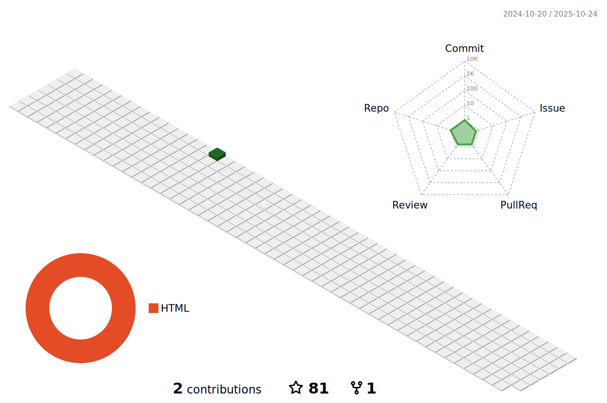

<!--  -->

  <a href="https://github.com/automaths/automaths">
    <picture>
      <source media="(prefers-color-scheme: dark)" srcset="./profile-3d-contrib/profile-night-green.svg">
      
    </picture>
  </a>

                 

